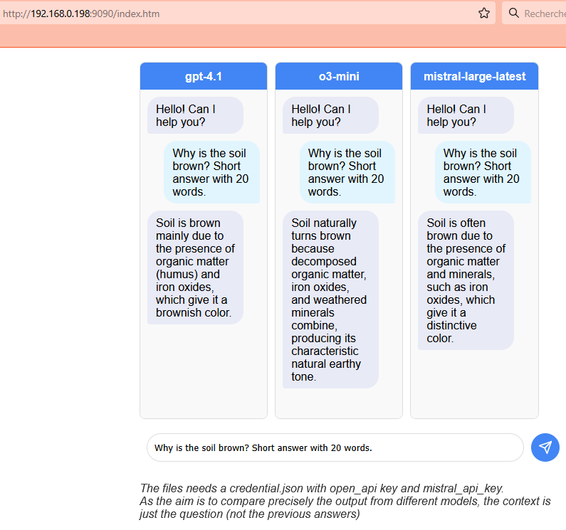

# multi-chat-api

The aim of this index.htm is to query simultaneously multiple LLM providers (or different models in one provider).

This is for evaluation and test purpose, as the API credentials are visible on the client side.

Just modify credentials.json to add your API credentials.

## Preliminary results

On may 2025, Mistral large latest is often the fatest. The results of Openai gpt-4.1 are nevertheless often more acurate. The model o3-mini is slow.

To compare in the same condition, the previous result is not added in the context. Each query is thus independant.

## Exemple screenshot

